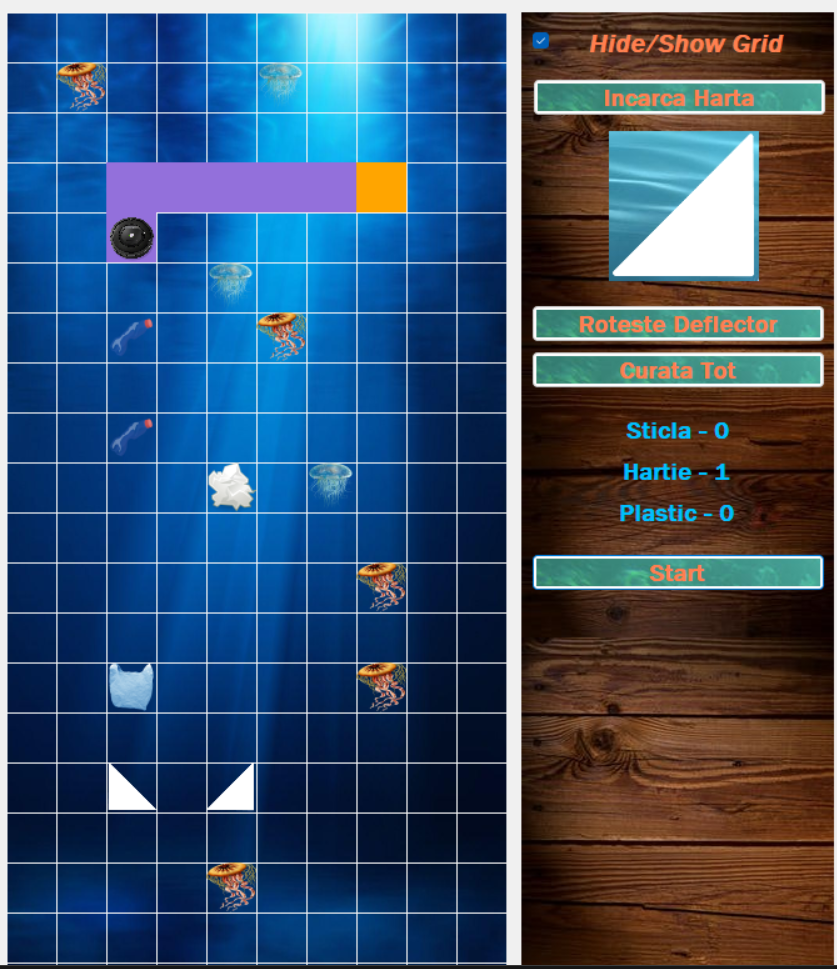

# 🌊 Interferențe ECO

Un joc puzzle-educațional dezvoltat în **C# (Windows Forms)** în care jucătorul trebuie să ghideze un robot pentru a curăța oceanul de deșeuri (Sticlă, Plastic, Hârtie), evitând în același timp vietățile marine.

---

---

# 🎮 Cum se joacă?
Începe aventura: Totul pornește prin încărcarea hărții pe care vrei să o cureți (dintr-un fișier .txt).

Ghidează robotul: Robotul nostru e super harnic, dar are o mică problemă: merge doar în linie dreaptă!. Va trebui să plasezi „deflectoare” pe traseu și să le rotești (Sus, Jos, Stânga, Dreapta) pentru a-i schimba traiectoria și a-l duce exact unde trebuie.

## 🏆 Reguli de aur
Ai adunat absolut fiecare bucată de deșeu de pe hartă? Felicitări, ai curățat zona cu succes și ai trecut nivelul!

Atenție la meduze! Traseul trebuie calculat cu mare grijă. Dacă robotul tău se ciocnește accidental de o meduză, misiunea eșuează. Protejarea ecosistemului are mereu prioritate!

---

## 🛠️ Instalare și Rulare (Build)

Deoarece jocul este construit folosind **Windows Forms**, ai nevoie de un mediu de dezvoltare compatibil cu ecosistemul .NET pe Windows.

### Cerințe:
* Sistem de operare: **Windows**
* [Visual Studio](https://visualstudio.microsoft.com/) (recomandat 2019, 2022) cu workload-ul `.NET desktop development` instalat.
